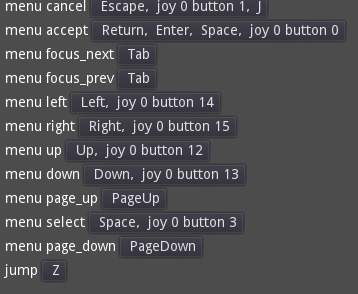
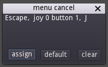

# Lazy input settings for godot projects

An ugly but quick way of putting user reconfiguration of inputs (keyboard, mouse, joystick) into your project.

Just install it as a plugin and drop a InputMenu node into any scene and it will create a menu allowing reconfiguraiton of any input actions your project defines. The config is persisted to `user://input_map.json`. Load it on startup by doing this:

    const InputMenu = preload("addons/godot-lazy-input-settings/input_menu.gd")
    ...
    InputMenu.load_input_map_from_file("user://input_map.json")

To make the "default" button work properly, save a `input_map.json` to `res://default_input_map.json`.
